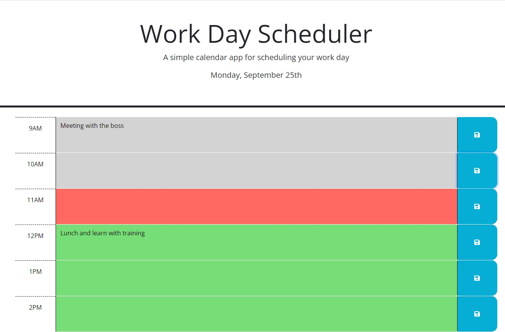

# WorkDayScheduler

## My Mission

Create a simple calendar application that allows a user to save events for each hour of a typical working day (9am&ndash;5pm). This app will run in the browser and feature dynamically updated HTML and CSS powered by jQuery.

## URL

https://julieabowers.github.io/WorkDayScheduler/

